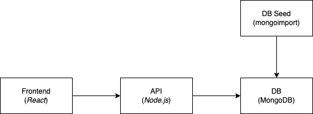

# Application

# Robin hat was geändert

# Jona hat was geändert #schickenspicker
# Ann-Christin hat was geändert
# Jona und Adrian! hat was geändert #schickenspicker


## Intro

Es handelt sich um eine (ältere) "three-tier" Applikation mit frontend, api, database.
Für diesen Hackathon dient die Applikation nur als Mittel zum Zweck, und die Entwicklung an der Applikation steht hier **nicht** im Fokus. Aus DevOps Sicht ist es trotzdem relevant zu wissen, wie die Architektur der Applikation aussieht und welche Technologien eingesetzt werden, da ihr bei dem Deployment und den Operationstätigkeiten unterstützen sollt.

## Architektur und Verzeichnis Struktur



Im `/application` Verzeichnis findet ihr drei Unterverzechnisse wieder.

- frontend - Das Web Frontend (Presentation Layer) in React geschrieben
- api - Die API (Logik Layer) in Node.js geschrieben
- db-seed - Eine Utility um die Datenbank zu befüllen

Die Datenbank selber ist wie ihr seht nicht als eigenes Verzechnis vorhanden, dass hat den Grund weil es aus Applikations Sicht egal ist wo die Datenbank ist. Gebräuchlich ist dass die Entwickler eine lokale Datenbank, in diesem Fall eine Mongo DB, hochfahren, als ein Container (wird in einer Challenge näher erläutert).

## Frontend

Die Applikation besteht im wesentlichen aus drei Seiten

- `/books` - Übersicht der Bücher und Verleihstatus
- `/books/:bookID` - Detail Seite eines Buches mit Button zum ausleihen und zurückgeben
- `/admin` - Admin Seite um Bücher zu verwalten


# Documentation


```sh
docker compose build
docker tag application_api schinkenspickermanual.azurecr.io/application_api:latest
docker tag application_frontend schinkenspickermanual.azurecr.io/application_frontend:latest
docker tag application_mongo-seed schinkenspickermanual.azurecr.io/application_mongo-seed:latest
az acr login -n schinkenspickermanual
docker push schinkenspickermanual.azurecr.io/application_frontend:latest
docker push schinkenspickermanual.azurecr.io/application_mongo-seed:latest
docker push schinkenspickermanual.azurecr.io/application_api:latest
```

```sh
terraform init
terraform plan
terraform apply
```